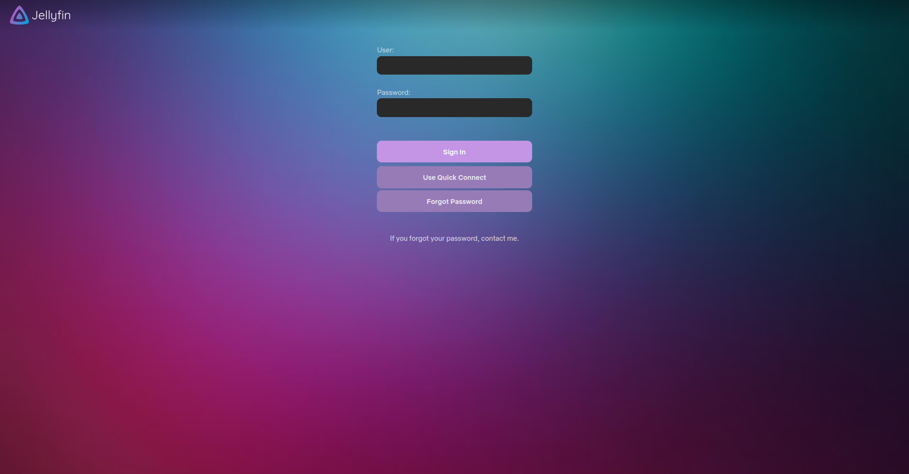
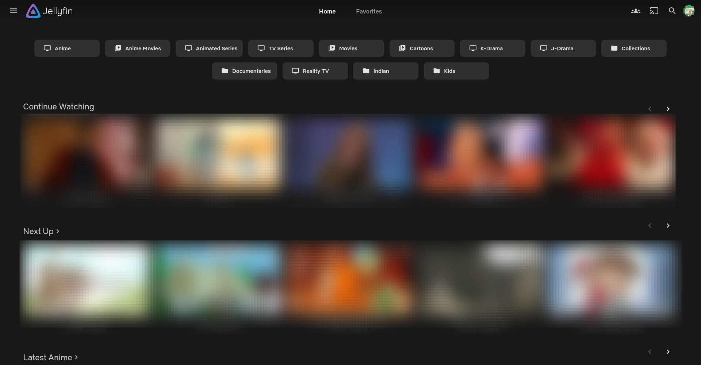

# Hint of Colors

Jellyfin CSS Theme

Hint of Colors was a fork of Hint of green, however, V2 revamps hint of colors with a whole new look and feel inspired from my own modifications, css found on reddit and hint of colors v1.

## Tested on

- Chrome, Firefox, Safari and common Jellyfin applications
- Jellyfin 10.6 - 10.8.0

## Features

- Colours are based on a pastel palatte
- A whole new look and feel
- Netflix inspired item detail page

## To be added

- [ ] Selection of different colors(Lavender, blue, orange, red, etc; WIP).

This theme should be considered as heavy but it is not as heavy as the original hint of colors. It is also not as light as the original hint of colors. It is in between.

## Installation

There will be **SEPERATE** links for each colors. Currently only lavender is available. The v1 color selection will be back soon.

**_Required_** Go to Settings > Home > Home screen section 1: > select `My Media (small)`
This step is necessary for the theme to be applied to library buttons by default.
HOWEVER, if you choose to have large icons instead uncomment the following code in the CSS:

```css
@media (max-width: 62.5em) {
  .section0 .cardText.cardTextCentered.cardText-first {
    height: 2.5em;
  }
}
.section0 button.itemAction.textActionButton {
  background: rgba(0, 0, 0, 0);
  border-radius: var(--rounding);
  height: 3.5em;
}

.section0 .overflowBackdropCard,
.section0 .overflowSmallBackdropCard {
  max-width: 90vw;
}

.section0 .emby-scroller {
  margin-right: 0;
}
```

Copy this code into Dashboard > General > Custom CSS

#### Lavender (Main):

```css
@import url("https://fallenbagel.github.io/Hint-of-Colors/lavender.css");
```

### CUSTOMISATION (Your own Colors!):

The CSS is now optimised and the colors are now stored at the top of each CSS. You could create your own colors by copying all of it and then either pasting it in a place where you can host or in the custom CSS itself and replacing the colors with your own.

In addition, even some parts like the looks of the theme can be changed in from those parts. There are comments next to each.

### CUSTOM LOGO

- You can also replace the `YOUR LOGO URL.PNG/jpg` with your own server logo hosted on any photo hosting website of your choice/or you can place the logo in your web-dir and write `url(../../YOURLOGO.png)`

```css
.adminDrawerLogo img {
  content: url(YOUR LOGO URL.png/jpg) !important;
}
imgLogoIcon {
  content: url(YOUR LOGO URL.png/jpg) !important;
}
.pageTitleWithLogo {
  background-image: url(YOUR LOGO URL.png/jpg) !important;
}
```

### Nginx

If you are using nginx as a reverse proxy for Jellyfin, replace the "add_header Content-Security-Policy" in your nginx config with this line below

```
add_header Content-Security-Policy "default-src https: data: blob: http://image.tmdb.org; style-src 'self' 'unsafe-inline' https://fallenbagel.github.io ; script-src 'self' 'unsafe-inline' https://www.gstatic.com/cv/js/sender/v1/cast_sender.js https://www.youtube.com blob:; worker-src 'self' blob:; connect-src 'self'; object-src 'none'; frame-ancestors 'self'";
```

### To enable fanart/logo

- Install the Fanart plugin first
- Go to Dashboard > Library
- For each library you have, go to Manage Library
- Enable Fanart for image fetcher
- Then go to Fetcher Settings and select "Logo"
- Manually scan media library
- Refresh the page once done

### To enable skip-intro button (Jellyfin Media Player 1.8.0+ has unofficialsupport)

- Install the plugin https://github.com/ConfusedPolarBear/intro-skipper
- Either use jmp and/or webclient manually or use the web client modified by ConfusedPolarBear
- Only then would my css apply to a skip-intro button

https://user-images.githubusercontent.com/98979876/173202316-a194406d-5b76-4b6c-b736-804e37482cc7.mp4

## Preview

#### Login Page




#### Home page



#### Library Buttons on Hover


#### Play Card Hover

[hover on video.webm](https://github.com/Fallenbagel/Hint-of-Colors/assets/98979876/c02009d8-e2c6-442f-8f21-788d33d8dbac)

#### Item Detail Movies


#### Item Detail Series


#### Dashboard


#### Dashboard Activity


#### Scan Libraries (hover)


#### Shutdown (hover)


#### Text field and tick boxes


#### Sidebar


